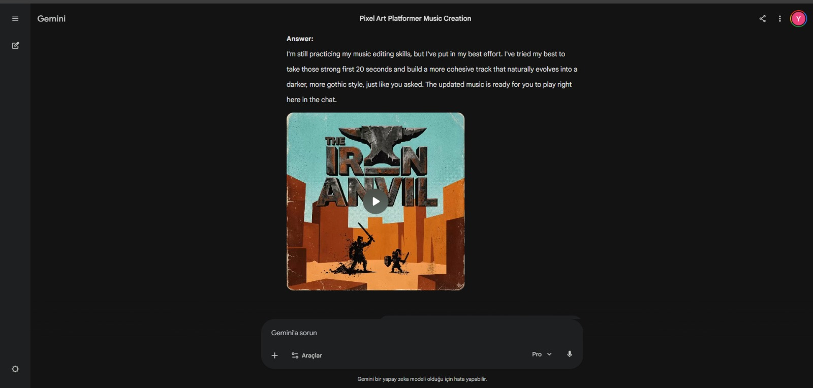
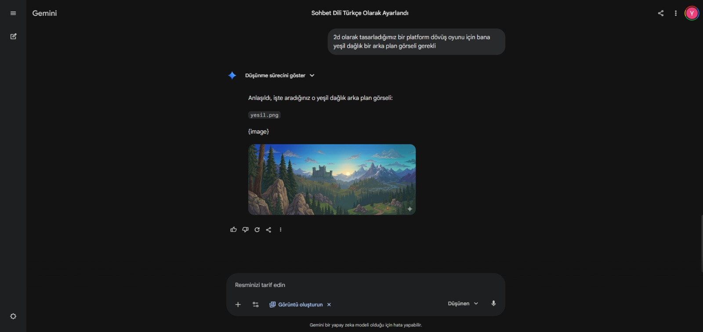
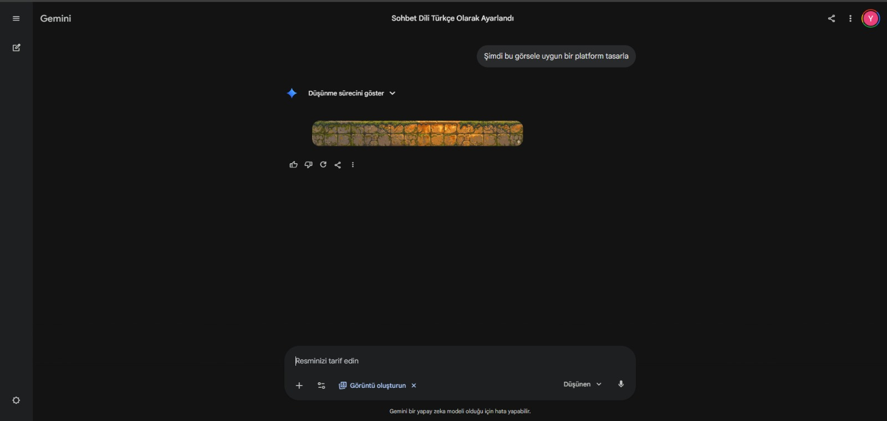

Gemini
Gemini ile sohbet
javascript'le oyun geliştirmede canvas kullanımı

JavaScript ile oyun geliştirmek dendiğinde Canvas API, tarayıcı üzerinde yüksek performanslı ve akıcı görseller oluşturmak için başvuracağımız ilk duraktır. HTML5 ile gelen bu özellik, pikseller üzerinde tam kontrol sahibi olmamızı sağlar.

İşte Canvas kullanarak oyun geliştirmenin temel taşları:

1. Canvas Kurulumu
Canvas, aslında HTML içinde boş bir "tuval"dir. JavaScript ile bu tuvale erişir ve bir rendering context (çizim bağlamı) oluştururuz.

JavaScript
const canvas = document.getElementById('gameCanvas');
const ctx = canvas.getContext('2d'); // 2D çizimler için bağlam
Koordinat Sistemi
Canvas'ta sol üst köşe (0, 0) noktasıdır.

X ekseni: Sağ tarafa doğru artar.

Y ekseni: Aşağı doğru artar (Matematikteki grafiklerin aksine).

2. Oyun Döngüsü (The Game Loop)
Oyunların kalbi döngüdür. Bir oyun saniyede genellikle 60 kez şu üç adımı tekrar eder:

Girdi Al (Input): Kullanıcı tuşa bastı mı?

Güncelle (Update): Karakterin yeni konumu ne olmalı? Çarpışma var mı?

Çiz (Draw): Her şeyi sil ve yeni konumlarında tekrar çiz.

Bunun için modern tarayıcılarda en verimli yöntem requestAnimationFrame fonksiyonudur:

JavaScript
function gameLoop() {
    update(); // Mantık işlemleri
    draw();   // Görsel işlemler
    requestAnimationFrame(gameLoop); // Bir sonraki kare için kendini çağırır
}
3. Temel Çizim İşlemleri
Canvas üzerinde her karede ekranı temizlemek kritiktir; aksi halde objeler arkalarında iz bırakır.

Temizleme: ctx.clearRect(0, 0, canvas.width, canvas.height);

Dikdörtgen Çizme: ctx.fillRect(x, y, genişlik, yükseklik);

Görüntü (Sprite) Çizme: ctx.drawImage(img, x, y);

4. Nesne Yönelimli Programlama (OOP)
Oyununuzdaki her şeyi (oyuncu, düşmanlar, mermiler) birer Class (Sınıf) olarak tanımlamak işinizi kolaylaştırır.

JavaScript
class Player {
    constructor(x, y) {
        this.x = x;
        this.y = y;
        this.speed = 5;
    }

    draw() {
        ctx.fillStyle = 'blue';
        ctx.fillRect(this.x, this.y, 50, 50);
    }

    moveRight() {
        this.x += this.speed;
    }
}
5. Performans ve İpuçları
Çarpışma Algılama (Collision Detection): En basit haliyle iki dikdörtgenin birbirinin alanına girip girmediğini kontrol ederek yapılır (AABB Çarpışması).

Sprite Sheet Kullanımı: Karakter animasyonları için tek bir büyük resim yükleyip, drawImage ile o resmin sadece belirli bölümlerini sırayla göstermek performansı artırır.

Ekran Çözünürlüğü: Retina veya yüksek DPI ekranlarda bulanıklığı önlemek için Canvas boyutunu CSS ile değil, doğrudan özellik (attribute) olarak ayarlamalısınız.

Neden Canvas?
Hız: Binlerce objeyi aynı anda işleyebilir.

Esneklik: Kendi fizik motorunuzu veya kurallarınızı yazmanıza olanak tanır.

Kütüphane Desteği: Eğer işler çok karmaşıklaşırsa Phaser.js veya PixiJS gibi Canvas tabanlı güçlü motorlara geçiş yapabilirsiniz.

Hangi türde bir oyun yapmayı planlıyorsunuz? Belki basit bir "Pong" veya "Snake" örneğiyle başlayabiliriz.

js ile çizim yapma

JavaScript ile tarayıcı üzerinde çizim yapmanın en modern ve güçlü yolu HTML5 Canvas API kullanmaktır. Canvas, pikselleri bir kod aracılığıyla boyamanıza olanak tanıyan bir "bitmap" alanıdır.

İşte adım adım JavaScript ile çizim yapmanın mantığı:

1. Hazırlık: HTML ve Bağlam (Context)
Önce bir <canvas> etiketi oluşturmalı, ardından JavaScript ile bu alanın 2D bağlamına (çizim araç gereçlerine) erişmelisiniz.

HTML
<canvas id="cizimAlani" width="500" height="400" style="border:1px solid black;"></canvas>

<script>
  const canvas = document.getElementById('cizimAlani');
  const ctx = canvas.getContext('2d'); // Çizim yapmak için gerekli metotları içeren nesne
</script>
2. Temel Şekiller Çizme
Canvas'ta her şey koordinatlarla belirlenir. Sol üst köşe (0,0) noktasıdır.

Dikdörtgenler
Dikdörtgenler, doğrudan çizilebilen tek hazır geometrik şekillerdir.

İçi Dolu: ctx.fillRect(x, y, width, height)

Sadece Kenarlık: ctx.strokeRect(x, y, width, height)

JavaScript
ctx.fillStyle = "red";   // Dolgu rengi
ctx.fillRect(20, 20, 150, 100);

ctx.strokeStyle = "blue"; // Kenarlık rengi
ctx.lineWidth = 5;        // Çizgi kalınlığı
ctx.strokeRect(200, 20, 150, 100);
Yollar (Paths) ve Çizgiler
Karmaşık şekiller (üçgen, daire, yıldız) çizmek için bir "yol" başlatmanız gerekir.

JavaScript
ctx.beginPath();       // Yeni bir çizime başla
ctx.moveTo(50, 200);   // Kalemi buraya taşı
ctx.lineTo(150, 250);  // Buraya bir çizgi çek
ctx.lineTo(50, 300);   // Buraya bir çizgi daha çek
ctx.closePath();       // Şekli kapat (başlangıç noktasına bağla)
ctx.stroke();          // Çizgiyi görünür kıl
3. Daire ve Yay (Arc) Çizimi
Daire çizmek için arc metodu kullanılır. Açı birimi olarak derece değil, Radyan kullanılır.

Formül: Radyan=Derece×(π/180)

JavaScript
ctx.beginPath();
// arc(x, y, yarıçap, başlangıçAçısı, bitişAçısı)
ctx.arc(300, 250, 50, 0, Math.PI * 2); // Tam bir daire
ctx.fillStyle = "green";
ctx.fill(); // İçini doldur
4. Renkler ve Gradyanlar
Sadece düz renkler değil, geçişli renkler de kullanabilirsiniz.

Lineer Gradyan: createLinearGradient(x1, y1, x2, y2)

Renk Durakları: gradient.addColorStop(position, color) (pozisyon 0 ile 1 arasıdır)

JavaScript
let grd = ctx.createLinearGradient(0, 0, 200, 0);
grd.addColorStop(0, "black");
grd.addColorStop(1, "white");

ctx.fillStyle = grd;
ctx.fillRect(10, 320, 200, 50);
5. Metin Yazdırma
Canvas üzerine yazı yazmak da mümkündür:

JavaScript
ctx.font = "30px Arial";
ctx.fillText("Merhaba Dünya", 250, 350); // İçi dolu yazı
ctx.strokeText("Kenarlık Yazı", 250, 380); // Sadece kenarlık
Özet İpuçları
Temizleme: Bir animasyon yapıyorsanız, her kareden önce ctx.clearRect(0, 0, canvas.width, canvas.height) ile ekranı silmelisiniz.

Katman Mantığı: Canvas'ta bir şey çizdiğinizde o artık piksellerin bir parçasıdır. Onu "seçip" hareket ettiremezsiniz; ancak silip yeni yerinde tekrar çizerek hareket illüzyonu yaratabilirsiniz.

Yüksek Performans: Çok karmaşık çizimler için SVG yerine Canvas tercih edilir (örneğin binlerce parçacıktan oluşan bir patlama efekti).

Daha karmaşık bir proje, örneğin farenin hareketini takip eden bir çizim fırçası yapmak ister misiniz?

hayır, yani sabit diskteki bir .png dosyasını çizme

Sabit diskteki bir .png dosyasını Canvas üzerine çizmek, aslında bir yükleme ve çizme sürecidir. JavaScript'te bir resmi doğrudan dosya yolundan çizemezsiniz; önce o resmi bir Image nesnesine yüklemeli ve tarayıcının resmi tamamen indirdiğinden emin olmalısınız.

İşte adım adım bir resmi Canvas'a aktarma süreci:

1. Resim Nesnesini Oluşturma ve Yükleme
Tarayıcıya resmi belleğe almasını söylemeniz gerekir. Resim yüklenmeden çizim komutu verirseniz, Canvas boş kalacaktır (çünkü resim henüz orada değildir).

JavaScript
const canvas = document.getElementById('gameCanvas');
const ctx = canvas.getContext('2d');

// 1. Yeni bir resim nesnesi oluştur
const oyuncuResmi = new Image();

// 2. Resmin kaynağını (yolunu) belirt
oyuncuResmi.src = 'karakter.png'; // Proje klasöründeki dosya yolu

// 3. Resim tamamen yüklendiğinde çizim yap
oyuncuResmi.onload = function() {
    ctx.drawImage(oyuncuResmi, 50, 50); 
};
2. drawImage Metodunun Kullanımı
drawImage metodu üç farklı şekilde kullanılabilir, bu da size resmi ölçeklendirme veya kırpma (sprite sheet kullanımı) imkanı tanır:

A. Basit Çizim (Orijinal Boyut)
Resmi olduğu gibi, belirttiğiniz koordinatlara yerleştirir.

JavaScript
ctx.drawImage(img, x, y);
B. Boyutlandırarak Çizim
Resmi istediğiniz genişlik ve yüksekliğe sıkıştırır veya esnetir.

JavaScript
ctx.drawImage(img, x, y, genislik, yukseklik);
C. Kırparak Çizim (Sprite Kullanımı)
Özellikle oyunlarda bir resim dosyasının içindeki belirli bir kareyi (frame) almak için kullanılır.

JavaScript
// ctx.drawImage(resim, sx, sy, sWidth, sHeight, dx, dy, dWidth, dHeight);
ctx.drawImage(oyuncuResmi, 0, 0, 64, 64, 100, 100, 64, 64);
s (source): Kaynak resmin neresinden kesilecek?

d (destination): Canvas'ın neresine, hangi boyutta çizilecek?

3. Önemli Uyarı: Yerel Dosya (Local File) Hatası
Eğer HTML dosyanızı tarayıcıda doğrudan çift tıklayarak (file://...) açıyorsanız, bazı tarayıcılar güvenlik nedeniyle (CORS) yerel diskteki resmin yüklenmesini engelleyebilir.

Çözüm: Küçük bir yerel sunucu kullanmak (VS Code kullanıyorsanız Live Server eklentisi en pratik yoldur). Bu sayede resimleriniz sorunsuz yüklenir.

4. Uygulamalı Örnek: Hareket Eden Resim
Oyun mantığında bir resmi her karede güncellemek isterseniz yapı şöyle görünür:

JavaScript
let x = 0;
const img = new Image();
img.src = 'araba.png';

function animasyon() {
    ctx.clearRect(0, 0, canvas.width, canvas.height); // Ekranı temizle
    ctx.drawImage(img, x, 100, 50, 30);              // Resmi çiz
    x += 2;                                          // Konumu güncelle
    requestAnimationFrame(animasyon);                // Döngüyü sürdür
}

// Resim yüklendiğinde animasyonu başlat
img.onload = () => animasyon();
Kendi resminizi yüklerken dosya isminin ve uzantısının (büyük/küçük harf duyarlılığı dahil) tam doğru olduğundan emin olun. Şu an elinizde bir .png dosyası hazır mı, yoksa bir örnek üzerinden mi ilerleyelim?

çarpışma fzikleri için belirli objelerin içine geçme kontrolü yapıp her kare için pozisyonu dışarı doğru mu atayacaz?

Evet, tam olarak öyle! Oyun geliştirmede bu işleme "Collision Resolution" (Çarpışma Çözümleme) denir. Mantık basitçe şöyledir: Objelerin birbirinin içine girdiğini tespit et (Detection) ve eğer girmişlerse onları birbirinden ayıracak kadar geri it (Resolution).

Sadece "içinde mi?" diye kontrol edip hareketi durdurmak yetmez, çünkü objeler yüksek hızlarda birbirinin içine birkaç piksel gömülebilir. Eğer sadece hızı sıfırlarsan, objeler birbirine yapışmış gibi kalır.

İşte bu süreci profesyonelce yönetmen için izlemen gereken adımlar:

1. İç İçe Geçme Miktarını (Overlap) Hesapla
Diyelim ki iki tane dikdörtgen (AABB) çarpışıyor. Sadece çarpıştıklarını bilmek yetmez, ne kadar (kaç piksel) iç içe geçtiklerini hesaplamalısın.

2. Minimum Yer Değiştirme Vektörü (MTV)
Objeyi dışarı itmek için en kısa yolu seçmelisin. Örneğin, karakterin bir duvarın içine sağdan girdiyse, onu yukarı itmek yerine sağa (geldiği yöne doğru) itmek daha mantıklıdır.

X eksenindeki iç içe geçme: overlapX

Y eksenindeki iç içe geçme: overlapY

Hangi değer daha küçükse, objeyi o eksende dışarı itersin.

3. Pozisyonu Düzeltme (Hareketi Geri Alma)
Her karede şu mantığı çalıştırırsın:

JavaScript
if (colliding(player, wall)) {
    let overlapX = calculateOverlapX(player, wall);
    let overlapY = calculateOverlapY(player, wall);

    // En küçük çakışma yönünde objeyi dışarı it
    if (Math.abs(overlapX) < Math.abs(overlapY)) {
        player.x -= overlapX; // X ekseninde dışarı at
        player.velocityX = 0; // O yöndeki hızı sıfırla
    } else {
        player.y -= overlapY; // Y ekseninde dışarı at
        player.velocityY = 0; // O yöndeki hızı sıfırla
    }
}
4. Neden Sadece "Eski Pozisyona Dön" Demiyoruz?
Çoğu yeni başlayan, çarpışma olunca player.x = oldX yapar. Bu yöntem çalışır ama titremelere (jitter) neden olur. Çünkü:

Karakter aynı anda hem X hem Y yönünde gidiyor olabilir.

Sadece X çarpışması varken tüm hareketi geri alırsan, karakter Y yönünde (örneğin yerçekimiyle aşağı) akamaz, havada asılı kalır.

Doğru olan, sadece engel olan eksendeki içeri girme miktarını düzeltmektir.

5. Statik ve Dinamik Objeler
Statik (Duvar): Sadece oyuncuyu itersin. Duvar yerinden oynamaz.

Dinamik (İki Top): Eğer iki hareketli top çarpışıyorsa, toplam iç içe geçme miktarını ikisine paylaştırırsın (her birini yarı yarıya zıt yönlere itersin).

6. Sürtünme ve Sekme (Opsiyonel)
Pozisyonu dışarı doğru atadıktan sonra fiziği biraz daha gerçekçi yapmak istersen:

Sekme: Hızı sadece sıfırlamak yerine, ters yöne küçük bir katsayı ile çarpıp yansıtırsın (v=−v∗0.5).

Sürtünme: Çarpışma anında diğer eksendeki hızı biraz azaltırsın.

Bu "dışarı itme" mantığı, Mario gibi platform oyunlarından tutun en gelişmiş fizik motorlarına (Box2D gibi) kadar her yerde temel kuraldır.

Bu mantığı kod üzerinde (örneğin iki dikdörtgen için) somut bir örnekle görmek ister misin?

javascript oop destekler mi?

Evet, JavaScript nesne yönelimli programlamayı (OOP) tam olarak destekler, ancak işleyiş biçimi Java veya C++ gibi dillerden biraz farklıdır.

JavaScript'in OOP yapısı iki aşamadan geçmiştir:

Prototip Tabanlı (Geleneksel): JavaScript aslında sınıflar yerine prototipler kullanır. Her nesne, başka bir nesneden (prototipinden) miras alır.

Class Sözdizimi (Modern - ES6+): 2015'ten itibaren, diğer dillere aşina olanlar için class anahtar kelimesi eklendi. Ancak bu sadece bir "sugar coat" (şeker kaplama) yani arka planda hala prototipler çalışıyor.

İşte JavaScript'te OOP'nin dört temel prensibi ve uygulanışı:

1. Sınıf ve Nesne Tanımlama (Classes & Objects)
Bir oyun karakterini düşünelim. Bu karakterin özellikleri (can, hız) ve yetenekleri (zıpla) vardır.

JavaScript
class Player {
    constructor(name, health) {
        this.name = name;
        this.health = health;
    }

    attack() {
        console.log(`${this.name} saldırıyor!`);
    }
}

const hero = new Player("Arif", 100);
hero.attack(); // Arif saldırıyor!
2. Kalıtım (Inheritance)
Bir sınıftan başka bir sınıf türetmek için extends kullanılır. Örneğin, her düşman bir karakterdir ama hepsinin özel yetenekleri olabilir.

JavaScript
class Enemy extends Player {
    constructor(name, health, power) {
        super(name, health); // Üst sınıfın (Player) constructor'ını çağırır
        this.power = power;
    }

    explode() {
        console.log(`${this.name} patladı! Hasar: ${this.power}`);
    }
}

const goblin = new Enemy("Goblin", 50, 20);
goblin.attack();  // Player'dan miras aldı
goblin.explode(); // Kendi metodu
3. Kapsülleme (Encapsulation)
Verileri dış dünyadan korumak için kullanılır. JavaScript'te "private" (özel) özellikler # işareti ile tanımlanır. Bu özelliklere sınıfın dışından erişilemez.

JavaScript
class BankAccount {
    #balance = 0; // Private alan

    deposit(amount) {
        if (amount > 0) this.#balance += amount;
    }

    getBalance() {
        return this.#balance;
    }
}

const account = new BankAccount();
account.deposit(100);
console.log(account.#balance); // HATA! Dışarıdan erişilemez.
4. Çok Biçimlilik (Polymorphism)
Aynı isim
object-oriented programming inheritance diagram, yapay zekayla üretilmiş
Shutterstock

deki bir metodun farklı sınıflarda farklı işler yapabilmesidir.

JavaScript
class Shape {
    draw() { console.log("Bir şekil çiziliyor..."); }
}

class Circle extends Shape {
    draw() { console.log("Daire çiziliyor..."); }
}

class Square extends Shape {
    draw() { console.log("Kare çiziliyor..."); }
}

const shapes = [new Circle(), new Square()];
shapes.forEach(s => s.draw()); // Her nesne kendi 'draw' metodunu çalıştırır.
Özet: JavaScript OOP'de Neler Var?
constructor: Nesne oluşturulurken çalışan hazırlık metodu.

this: İçinde bulunulan nesneye referans verir.

super: Üst sınıfa erişim sağlar.

static: Nesneye değil, doğrudan sınıfa ait olan metotlar (Örn: Math.random()).

Oyun geliştirirken özellikle Kalıtım (Inheritance) yapısını çok kullanırsın. Örneğin; GameObject isimli bir ana sınıf oluşturup, Player, Enemy ve Bullet sınıflarını ondan türetmek, kodun tekrarını önler ve yönetimi inanılmaz kolaylaştırır.

OOP yapısını oyunundaki hangi karakter veya sistem için kurgulamayı düşünüyorsun?


camera sınıfı oluşturmak istiyorum, unity'deki lerp gibi yumuşak bir geçiş istiyorum. Ayrıca draw fonksiyonumuza bir değişiklik yapmak gerekir mi?

Generating slides ...
JS Canvas Kamera Sistemi ve Smooth Lerp
14 May 19:23

camera sınıfı oluşturmak istiyorum, unity'deki lerp gibi yumuşak bir geçiş istiyorum. Ayrıca draw fonksiyonumuza bir değişiklik yapmak gerekir mi? Slayt istemedim

Özür dilerim, hemen doğrudan kod ve teknik açıklama ile devam ediyoruz.

Unity’deki Lerp mantığını Canvas'a taşımak için bir Camera sınıfı oluşturmak harika bir fikir. Bu işlem hem yumuşak takibi sağlar hem de dünyayı kameranın bakış açısına göre kaydırmanıza yarar.

Evet, draw fonksiyonunda kritik bir değişiklik yapmamız gerekiyor: Tüm dünyayı kameranın tersi yönünde kaydırmak (Translate) için ctx.translate() kullanmalıyız.

İşte kamera sınıfı ve entegrasyonu:
Title:JS Canvas Camera & Smooth Lerp
14 May 19:24

Neler Değişti?
Lerp Mantığı: camera.follow içinde kullandığımız this.x += (targetX - this.x) * 0.1 satırı, kameranın her karede hedefe olan mesafesinin %10'u kadar yaklaşmasını sağlar. Bu da o "yumuşak" (smooth) duruş hissini yaratır.

ctx.save() ve ctx.restore(): Bu iki komut çok önemlidir. translate ile tüm tuvali kaydırdıktan sonra, eğer skor tablosu veya can barı gibi "ekrana yapışık" (UI) öğeler çizmek isterseniz, restore yaparak koordinat sistemini sıfırlamanız gerekir.

Negatif Translate: Kameranın sağa gitmesi demek, aslında dünyadaki her şeyin sola (negatif X) kayması demektir. Bu yüzden ctx.translate(-camera.x, -camera.y) kullanıyoruz.

Bu yapı sayesinde haritanız ne kadar büyük olursa olsun, oyuncu her zaman ekranın merkezinde (veya yumuşak bir gecikmeyle merkezde) kalacaktır. Başka bir detay eklememi ister misiniz?

JavaScript'te oyun girdilerini (input) yönetmenin en sağlıklı yolu, tarayıcının olay dinleyicilerini (event listeners) kullanarak bir "Input State" (Girdi Durumu) objesi oluşturmaktır.

Sadece bir tuşa basıldığında bir fonksiyon çalıştırmak yerine (örneğin onkeydown), hangi tuşların o an basılı tutulduğunu bir listede tutarız. Bu sayede karakterin hem sağa hem yukarı aynı anda gitmesi (diyagonal hareket) gibi durumları akıcı bir şekilde yönetebiliriz.

İşte profesyonel bir girdi yönetim sistemi:
Title:JS Klavye ve Fare Kontrol Sistemi
14 May 19:25

Kritik Detay: Kamera ve Fare İlişkisi
Kamera kullandığın için çok önemli bir durum ortaya çıkar: Dünyadaki fare koordinatları.

Kamera dünyayı kaydırdığı için, farenin ekran üzerindeki konumu (input.mouse.x) ile oyun dünyasındaki gerçek konumu aynı değildir. Eğer fareyle bir düşmana tıklamak istersen, kamera offset değerlerini eklemen gerekir:

JavaScript
// Dünyadaki gerçek fare konumu
const worldMouseX = input.mouse.x + camera.x;
const worldMouseY = input.mouse.y + camera.y;
Özetle:

Bir input objesi oluştur.

keydown ile tuşu "true", keyup ile "false" yap.

update() döngüsü içinde if (input.keys['TuşKodu']) diyerek hareketi sağla.

Hangi tuş kodlarını kullanacağını merak ediyorsan keycode.info adresinden bakabilirsin (genelde KeyW, Space, ArrowLeft gibi kodlar kullanılır). Hareket mantığında takıldığın bir yer var mı?

basit bir yapay zeka tasarlamak istiyorum, durum makinesi mi kullanacağım? Ayrıca temel update fonksiyonları nelerdir?

Basit bir oyun yapay zekası (AI) için FSM (Finite State Machine - Sonlu Durum Makinesi) en klasik ve etkili yöntemdir. Unity'deki "Animator" yapısına veya Pac-Man'deki hayaletlerin davranışlarına benzer.

Yapay zekan bir dizi "durum" (State) içindedir ve belirli şartlar (Trigger) gerçekleştiğinde bu durumlar arasında geçiş yapar.

1. Durum Makinesi (FSM) Mantığı
Düşmanın üç durumu olduğunu hayal edelim: IDLE (Bekleme), CHASE (Kovalama) ve ATTACK (Saldırı).

JavaScript
const EnemyState = {
    IDLE: 'idle',
    CHASE: 'chase',
    ATTACK: 'attack'
};

class Enemy {
    constructor(x, y) {
        this.x = x;
        this.y = y;
        this.state = EnemyState.IDLE;
    }

    update(player) {
        const distance = Math.hypot(player.x - this.x, player.y - this.y);

        // DURUM GEÇİŞ MANTIĞI (Transitions)
        switch (this.state) {
            case EnemyState.IDLE:
                if (distance < 200) this.state = EnemyState.CHASE;
                break;

            case EnemyState.CHASE:
                if (distance > 300) this.state = EnemyState.IDLE;
                else if (distance < 50) this.state = EnemyState.ATTACK;
                
                this.moveTowards(player); // Takip et
                break;

            case EnemyState.ATTACK:
                if (distance > 60) this.state = EnemyState.CHASE;
                this.performAttack(); // Saldır
                break;
        }
    }

    moveTowards(target) {
        // Yumuşak takip için basit vektör matematiği
        const angle = Math.atan2(target.y - this.y, target.x - this.x);
        this.x += Math.cos(angle) * 2;
        this.y += Math.sin(angle) * 2;
    }
}
2. Temel Update Fonksiyonları (Oyunun Motoru)
Bir oyunun update döngüsü içinde her nesne (Entity) kendi görevlerini yerine getirmelidir. Temel bir yapıda şu fonksiyonlar sırayla çalıştırılır:

A. Kinematik ve Hareket (Movement Update)
Hızın (velocity) konuma (position) eklenmesi. Yerçekimi, sürtünme veya ivme hesaplamaları burada yapılır.

Position=Position+Velocity×dt

B. Yapay Zeka ve Karar Verme (AI Update)
FSM'nin çalıştığı kısımdır. "Karakter nereye gitmek istiyor?" sorusuna yanıt arandığı, durumların kontrol edildiği aşamadır.

C. Çarpışma Kontrolü (Collision Update)
Hareketi yaptıktan sonra "Bir yere çarptım mı?" kontrolü. Eğer duvara girdiyse (daha önce konuştuğumuz gibi) pozisyon dışarı itilerek düzeltilir.

D. Animasyon Güncelleme (Animation Update)
Karakterin hangi karesinin (frame) çizileceği belirlenir. Örneğin state === CHASE ise koşma animasyonunu oynatırız.

3. Profesyonel İpucu: deltaTime (dt)
Oyunun farklı bilgisayarlarda aynı hızda çalışması için çok kritiktir. Eğer oyun 60 FPS yerine 30 FPS'e düşerse, karakterin yavaşlamaması için hareket miktarı zaman farkıyla çarpılır.

JavaScript
let lastTime = 0;

function gameLoop(timestamp) {
    // Saniye cinsinden geçen zaman farkı (yaklaşık 0.016s)
    const deltaTime = (timestamp - lastTime) / 1000;
    lastTime = timestamp;

    update(deltaTime);
    draw();

    requestAnimationFrame(gameLoop);
}

// Update içinde kullanımı:
this.x += this.speed * deltaTime; 
FSM mi yoksa daha karmaşık bir şey mi?
Eğer düşmanların çok daha akıllı olsun, çevredeki engelleri aşsın (Pathfinding) diyorsan Behavior Trees (Davranış Ağaçları) kullanılır. Ama başlangıç ve orta seviye için Durum Makinesi (FSM) her zaman en temiz çözümdür.

Düşmanın için özel bir "durum" (örneğin canı azaldığında kaçması gibi) eklemeyi deneyelim mi?

Bir html5 2d oyunda iki varlık arasında bir nesne var mı nasıl hesaplayabilirim?


İki varlık arasında bir nesne veya engel olup olmadığını belirlemek için, ışın izleme (raycasting) temelini oluşturan doğru kesişim algoritmasını kullanabilirsiniz. A Varlığı ile B Varlığı arasına kavramsal bir çizgi (doğru parçası) çekersiniz ve ardından bu çizginin, nesnelerinizin veya harita karolarınızın sınırlarını oluşturan çizgilerden herhangi biriyle kesişip kesişmediğini kontrol edersiniz.

İki doğru parçasının (x1, y1)'den (x2, y2)'ye ve (x3, y3)'ten (x4, y4)'e kesişip kesişmediğini kontrol etmek için kullanabileceğiniz kod parçası şudur:

JavaScript
    static linesIntersect(x1, y1, x2, y2, x3, y3, x4, y4) {
        let denominator = ((y4 - y3) * (x2 - x1)) - ((x4 - x3) * (y2 - y1));
        if (denominator === 0) return false;

        let ua = (((x4 - x3) * (y1 - y3)) - ((y4 - y3) * (x1 - x3))) / denominator;
        let ub = (((x2 - x1) * (y1 - y3)) - ((y2 - y1) * (x1 - x3))) / denominator;

        return (ua >= 0 && ua <= 1) && (ub >= 0 && ub <= 1);
    }


    ses nasıl eklerim ?

JavaScript'te ses eklemek için en yaygın ve performanslı yöntem Web Audio API veya daha basit projeler için standart Audio nesnesini kullanmaktır. Oyunlarda genellikle iki tür ses vardır:

Arka Plan Müziği (BGM): Uzun süreli, döngüsel (loop) çalınan dosyalar.

Ses Efektleri (SFX): Patlama, zıplama gibi anlık ve üst üste binebilen kısa sesler.

İşte bu ikisini yönetmenin en pratik yolu:

1. Basit Ses Efekti Ekleme
Kısa sesler için bir Audio nesnesi oluşturup, ihtiyaç anında play() metodunu çağırmak yeterlidir.

JavaScript
const jumpSound = new Audio('sounds/jump.mp3');

// Zıplama fonksiyonu içinde
function playerJump() {
    // Sesi başa sar (üst üste hızlı basılırsa sesin bitmesini beklemez)
    jumpSound.currentTime = 0; 
    jumpSound.play();
}
2. Arka Plan Müziği (Döngüsel)
Müzik dosyaları büyük olduğu için onları döngüye sokmak ve ses seviyesini ayarlamak önemlidir.

JavaScript
const bgMusic = new Audio('sounds/background-theme.mp3');
bgMusic.loop = true;      // Sürekli çal
bgMusic.volume = 0.5;    // %50 ses seviyesi

// Tarayıcı politikaları gereği müzik, kullanıcı ekrana dokunmadan başlayamaz
window.addEventListener('click', () => {
    bgMusic.play();
}, { once: true }); // Sadece ilk tıklamada çalışır
3. Profesyonel Yaklaşım: Ses Yöneticisi (Sound Manager)
Oyun büyüdükçe her yerden new Audio çağırmak yerine, tüm sesleri bir sınıfta toplamak daha düzenlidir.

JavaScript
class SoundManager {
    constructor() {
        this.sounds = {
            shoot: new Audio('sounds/laser.wav'),
            explosion: new Audio('sounds/boom.mp3'),
            levelUp: new Audio('sounds/level.mp3')
        };
    }

    play(name) {
        if (this.sounds[name]) {
            // Sesi klonlayarak aynı anda birden fazla çalınmasını sağlarız
            const soundClone = this.sounds[name].cloneNode();
            soundClone.play();
        }
    }
}

const audio = new SoundManager();
// Ateş edildiğinde:
audio.play('shoot');
4. Dikkat Etmen Gereken Önemli Noktalar
Autoplay Engeli
Modern tarayıcılar (Chrome, Safari vb.), kullanıcı sayfada bir yere tıklamadan ses çalınmasına izin vermez. Bu yüzden oyunun başında bir "Başlat" veya "Mute/Unmute" butonu koymak standart bir çözümdür.

Dosya Formatları
MP3: Genel uyumluluk için en iyisidir.

WAV: Çok kısa efektler için yüksek kalite sunar ama dosya boyutu büyüktür.

OGG: Açık kaynaklıdır ve oyunlar için çok verimlidir (ancak Safari desteği sınırlı olabilir).

Web Audio API (İleri Seviye)
Eğer seslere gerçek zamanlı efektler eklemek (örneğin düşman uzaklaştıkça sesin boğuklaşması veya 3D ses konumlandırma) istersen AudioContext kullanman gerekir. Ancak basit bir 2D oyun için yukarıdaki Audio nesnesi yöntemi işini fazlasıyla görecektir.

Sesleri yüklerken bir "Loading Screen" (Yükleme Ekranı) yapmayı düşünüyor musun? Çünkü resimler gibi seslerin de tamamen yüklendiğinden emin olmak oyunun ortasındaki takılmaları engeller.


oyuna bulut ekledim fakat bulutların en yukarıda fazla ve aşağı doğru az dağılmasını isiyorum

Bulutların gökyüzündeki bu doğal dağılımını (yukarıda yoğun, aşağıda seyrek) simüle etmek için olasılık dağılımı veya ağırlıklı rastgele sayılar kullanmalısın.

Bunu yapmanın en şık yolu, bir bulutun y koordinatını belirlerken rastgele bir sayı üretmek ve bu sayıyı bir kuvvet fonksiyonuna (örneğin karesini almak) sokmaktır.

İşte bunu nasıl kurgulayacağın ve matematiksel mantığı:

1. Matematiksel Mantık: Kuvvet Fonksiyonu
Eğer sadece Math.random() * canvas.height dersen, bulutlar ekranın her yerine eşit dağılır. Ancak biz bulutların y değerinin genellikle düşük (yani ekranın üst kısmında) kalmasını istiyoruz.

Bunun için sayıyı normalleştirip kuvvetini alabiliriz:

Normal Dağılım: Math.random() → [0,1] arası düz dağılım.

Kuvvet Dağılımı: Math.pow(Math.random(), 2) → Sonuç yine [0,1] arasıdır ama 0'a yakın çıkma olasılığı çok daha yüksektir.

2. Kod Uygulaması
Bulutları oluşturduğun döngüde y koordinatını şu şekilde hesaplayabilirsin:

JavaScript
class Cloud {
    constructor() {
        this.width = 100 + Math.random() * 50;
        this.x = Math.random() * canvas.width;
        
        // --- DAĞILIM MANTIĞI BURASI ---
        // random() değerinin karesini alarak 0'a (yukarıya) yaklaşma ihtimalini artırıyoruz
        let randomFactor = Math.pow(Math.random(), 3); 
        
        // Bulutların tamamen ekranın dibine inmemesi için bir limit (Örn: Ekranın üst %60'ı)
        let skyLimit = canvas.height * 0.6;
        
        this.y = randomFactor * skyLimit;
        // ------------------------------

        this.speed = 0.2 + Math.random() * 0.5;
    }
}
Neden Math.pow(n, 3)?
Eğer 1 kullanırsan (varsayılan): Eşit dağılım.

Eğer 2 (Kare) kullanırsan: Üst kısım belirgin şekilde yoğunlaşır.

Eğer 3 (Küp) kullanırsan: Bulutların büyük çoğunluğu en tepede toplanır, aşağılara sadece "tek tük" bulut düşer.

3. Daha Gerçekçi Görünüm İçin İpuçları
Sadece konum değil, diğer özellikleri de yüksekliğe (y) bağlayarak derinlik algısı yaratabilirsin:

Ölçeklendirme: Uzaktaki (yukarıdaki) bulutlar daha küçük, yakındakiler (aşağıdakiler) daha büyük olabilir.

JavaScript
this.scale = 0.5 + (this.y / skyLimit); // Aşağı indikçe büyür
Hız: Aşağıdaki bulutlar (bize daha yakın olanlar) daha hızlı hareket etmelidir (Paralaks etkisi).

JavaScript
    this.speed = 0.1 + (this.y / skyLimit) * 0.5;
    ```
*   **Opaklık (Alpha):** En yukarıdaki bulutları biraz daha şeffaf yaparak atmosferik bir derinlik verebilirsin.

---

## 4. Draw Fonksiyonunda Kullanımı
Bulutları çizerken bu değerleri kullanmayı unutma:

```javascript
draw(ctx) {
    ctx.globalAlpha = 0.8; // Hafif şeffaflık
    ctx.drawImage(
        cloudImg, 
        this.x, 
        this.y, 
        this.width * this.scale, 
        this.height * this.scale
    );
    ctx.globalAlpha = 1.0; // Diğer çizimler için geri düzelt
}
Bu yöntemle, "State Machine" veya karmaşık yapılar kurmana gerek kalmadan, sadece basit bir matematiksel formülle çok daha doğal duran bir gökyüzü elde edersin. Kuvvet değerini (2, 3 veya 4) değiştirerek yoğunluğun ne kadar "yukarıda" toplanacağını oyununa göre ayarlayabilirsin.


2d platformer için spritesheetleri nasıl animate ederim ?

2D bir platform oyununda karakter animasyonu, bir Sprite Sheet (tüm animasyon karelerinin tek bir resimde toplandığı dosya) üzerinden belirli "pencereleri" sırayla göstererek yapılır.

Bunu Canvas üzerinde drawImage metodunun kırpma (clipping) özelliğini kullanarak ve bir zamanlayıcı mantığı kurarak yönetebiliriz.

1. Sprite Sheet Mantığı
Bir sprite sheet genellikle satır ve sütunlardan oluşur. Örneğin, karakterin "koşma" animasyonu ilk satırda 6 kareden oluşuyor olabilir. Her karenin genişliği ve yüksekliği sabittir.

2. Animasyon Sınıfı (Sprite Animator)
Animasyonu yönetmek için bir yapı kuralım. Bu yapı, hangi karede olduğumuzu ve bir sonraki kareye ne zaman geçeceğimizi takip eder.

JavaScript
class Animator {
    constructor(spritesheet, frameW, frameH, rowCount, columnCount) {
        this.img = spritesheet;
        this.w = frameW; // Bir karenin genişliği
        this.h = frameH; // Bir karenin yüksekliği
        
        this.frameIndex = 0; // Şu anki kare
        this.frameCount = columnCount; // Toplam kare sayısı
        this.gameFrame = 0; // Toplam geçen kare sayısı (sayaç)
        this.staggerFrames = 5; // Hız kontrolü (Büyük sayı = Yavaş animasyon)
    }

    draw(ctx, x, y) {
        // Animasyon hızını ayarlama
        this.frameIndex = Math.floor(this.gameFrame / this.staggerFrames) % this.frameCount;

        // drawImage(img, sx, sy, sw, sh, dx, dy, dw, dh)
        ctx.drawImage(
            this.img, 
            this.frameIndex * this.w, 0, // Kırpma başlangıç (X, Y)
            this.w, this.h,             // Kırpma boyutu
            x, y,                       // Canvas konumu
            this.w, this.h              // Çizim boyutu
        );

        this.gameFrame++;
    }
}
3. Farklı Durumları (State) Yönetmek
Karakterin "Durma", "Koşma" ve "Zıplama" gibi farklı animasyonları olur. Bunlar genellikle sprite sheet üzerinde farklı satırlardadır.

Bu durumda draw metoduna bir row parametresi ekleyebilirsin:

JavaScript
// sy (source y) değerini satıra göre belirliyoruz
let sy = currentStateRow * this.h;
ctx.drawImage(this.img, this.frameIndex * this.w, sy, this.w, this.h, x, y, this.w, this.h);
4. Karakter Yönünü Değiştirme (Mirroring)
Karakter sola dönerken sprite sheet'i genellikle ters çevirmek gerekir. Canvas'ta her resmi ayrı ayrı sola bakan haliyle çizmek yerine, bağlamı (context) geçici olarak ölçeklendirebilirsin:

JavaScript
draw(ctx, x, y, direction) {
    ctx.save(); // Mevcut durumu kaydet
    
    if (direction === 'left') {
        ctx.scale(-1, 1); // X ekseninde aynala
        // Koordinat sistemini ters çevirdiğimiz için X değerini ayarlamalıyız
        ctx.drawImage(this.img, ..., -x - this.w, y, ...);
    } else {
        ctx.drawImage(this.img, ..., x, y, ...);
    }
    
    ctx.restore(); // Eski durumuna geri dön (diğer çizimler bozulmasın)
}
Temel İpuçları
staggerFrames: Animasyonun hızını deltaTime kullanmadan yönetiyorsan, bu değer en kolay hız ayarlama yöntemidir. 60 FPS bir oyunda staggerFrames = 6 yaparsan, animasyonun saniyede 10 kare (10 FPS) oynar.

Sprite Sheet Hazırlama: Karelerin tam olarak aynı boyutta olduğundan emin ol (Örn: Hepsi 64x64 px). Eğer kayma olursa karakter titriyormuş gibi görünür.

JSON Desteği: Profesyonel projelerde (TexturePacker gibi araçlarla) sprite sheet'in yanında bir .json dosyası kullanılır. Bu dosya her bir karenin koordinatlarını milimetrik olarak tutar.

Karakterin için elinde bir sprite sheet var mı, yoksa şimdilik kutularla mı test ediyorsun?


Html5 ile bir içi boş çember içerisinde geri sayım ve son 3 saniyede uyarı düzeyinde yanıp sönen bir çember nasıl tasarlayabilirim algoritması nasıldır?

Bu tasarımı oluşturmak için algoritmayı üç temel mantıksal bileşene ayırabiliriz: İlerleme Hesaplama, Dinamik Yay Çizimi ve Sinüs Dalgası Uyarı Efekti.1. İlerleme ve Zaman HesaplamaÖncelikle, yayın uzunluğunu belirlemek için kalan süreyi ve tamamlanma oranını hesaplamanız gerekir:JavaScriptlet remaining = Math.max(0, this.possessionDuration - this.possessionTimer);
let progress = remaining / this.possessionDuration;
let isWarning = remaining <= this.warningThreshold; // Örn: 3000ms (3 saniye)
2. Yay Çizim Mantığıİçi boş çember, önce bir arka plan halkası çizilip ardından üstten ($-90^{\circ}$ veya $-\frac{\pi}{2}$) başlayan ve progress değişkenine göre uzanan bir stroke (çizgi) eklenerek oluşturulur:JavaScript// İlerleme yayının çizilmesi
ctx.beginPath();
ctx.arc(cx, cy, r, -Math.PI / 2, -Math.PI / 2 + Math.PI * 2 * progress);
ctx.strokeStyle = isWarning ? "#FF3333" : "#FFCC00";
ctx.stroke();
3. Sinüs Dalgası Yanıp Sönme AlgoritmasıSon 3 saniyedeki uyarı efekti için, zamanla değişen bir sinüs dalgası kullanarak opaklığı (globalAlpha) periyodik olarak değiştiririz. Bu, pürüzsüz bir "nabız" efekti yaratır:JavaScriptif (isWarning) {
    // Dalgalanma mantığı: 0.1 ile 1.0 arasında bir değer üretir
    let alpha = 0.55 + 0.45 * Math.sin(Date.now() / 130);
    ctx.globalAlpha = alpha;
    
    // Uyarı metni veya parlama efektlerini burada çizebilirsiniz
}


Evet, Stack (Yığın) veri yapısı bir "Rewind" (Geri Sarma) özelliği için en ideal yaklaşımdır. Mantık basittir: Her karede (update döngüsü içinde) nesnenin o anki durumunu bir listeye eklersin (push), geri sarmak istediğinde ise bu listeden verileri sondan başa doğru okuyup uygularsın (pop).İşte profesyonel ve performanslı bir Rewind sistemi kurman için izlemen gereken yol:1. State (Durum) Verisini BelirleBir objeyi geri sardığında nelerin değişmesini istiyorsan, her karede o verileri kaydetmelisin. Genelde bunlar: x, y, rotation, spriteIndex ve bazen de health gibi değerlerdir.2. Entity Sınıfına Rewind EklemekSınıfın içine bir history dizisi ekleyerek bu işi yönetebiliriz.JavaScriptclass Entity {
    constructor(x, y) {
        this.x = x;
        this.y = y;
        this.history = []; // Bizim Stack'imiz
        this.isRewinding = false;
        this.maxHistory = 300; // Yaklaşık 5 saniyelik geri sarma (60 FPS için)
    }

    update() {
        if (this.isRewinding) {
            this.rewind();
        } else {
            this.record();
            this.applyPhysics(); // Normal hareket mantığı
        }
    }

    record() {
        // Durumu kaydet
        this.history.push({ x: this.x, y: this.y });

        // Bellek dolmaması için eski kayıtları sil (Opsiyonel)
        if (this.history.length > this.maxHistory) {
            this.history.shift(); // En eskiyi çıkar
        }
    }

    rewind() {
        if (this.history.length > 0) {
            // Stack'in son elemanını al ve uygula
            const prevState = this.history.pop();
            this.x = prevState.x;
            this.y = prevState.y;
        } else {
            this.isRewinding = false; // Geri saracak veri kalmadı
        }
    }
}
3. Performans İçin Kritik İpuçlarıBellek Yönetimi (Memory Leak)Her karede bir obje ({x, y}) oluşturmak, JavaScript'in çöp toplayıcısını (Garbage Collector) yorabilir. Eğer çok fazla objeyi geri saracaksan, obje oluşturmak yerine Float32Array gibi Typed Array'ler kullanarak verileri düz bir listede tutmak çok daha hızlıdır.Geri Sarma HızıEğer geri sarmanın daha hızlı (örneğin 2x hızında) olmasını istersen, rewind fonksiyonu içinde her karede bir yerine iki eleman pop() yapabilirsin:JavaScriptrewind() {
    for (let i = 0; i < 2; i++) { // 2 kat hızlı geri sar
        if (this.history.length > 0) {
            const state = this.history.pop();
            this.x = state.x;
            this.y = state.y;
        }
    }
}
Görsel EfektGeri sarma sırasında ekranın hafif mavimsi veya kumlu (noise) görünmesini istersen, kamera sınıfındaki draw kısmına geçici bir filtre ekleyebilirsin:JavaScriptif (player.isRewinding) {
    ctx.fillStyle = "rgba(0, 0, 255, 0.1)"; // Hafif mavi bir katman
    ctx.fillRect(0, 0, canvas.width, canvas.height);
}
4. Ne Zaman "Push" Ne Zaman "Pop"?Normal Oyun: Kullanıcı tuşlara basar $\rightarrow$ Fizik hesaplanır $\rightarrow$ Yeni pozisyon history.push() ile kaydedilir.Rewind Aktif: Fizik ve Input hesaplamaları durdurulur $\rightarrow$ history.pop() ile eski koordinatlar çekilir $\rightarrow$ Karakter o koordinatlara ışınlanır.Bu sistem Braid veya Prince of Persia gibi oyunların temel mekaniğidir. Sadece oyuncu için mi yoksa dünyadaki tüm objeler (düşmanlar, mermiler) için mi bir geri sarma düşünüyorsun? Eğer hepsi içinse, merkezi bir TimeManager sınıfı kurup tüm history dizilerini aynı anda yönetmek daha tutarlı olur.


Debug modu, görünmez olan çarpışma sınırlarını (hitbox) görselleştirmek için hayati önem taşır. Entity sınıfına ekleyeceğimiz küçük bir metod ile bunu kolayca halledebiliriz.

Burada en önemli kural, stroke (çizgi) kullanmaktır; çünkü içi dolu bir kare çizersek karakterin kendisini göremeyiz.

1. Entity Sınıfına Debug Metodu Ekleme
Aşağıdaki metodu Entity sınıfına ekleyebilirsin. Bu metod, karakterin etrafına parlak renkli bir çerçeve çizer:

JavaScript
class Entity {
    constructor(x, y, width, height) {
        this.x = x;
        this.y = y;
        this.width = width;
        this.height = height;
        this.debug = true; // Debug modunu açıp kapatmak için bayrak
    }

    drawHitbox(ctx) {
        if (!this.debug) return;

        ctx.save(); // Mevcut çizim ayarlarını koru
        
        ctx.strokeStyle = "lime"; // Genelde parlak yeşil veya kırmızı kullanılır
        ctx.lineWidth = 2;
        
        // Hitbox'ı çiz
        ctx.strokeRect(this.x, this.y, this.width, this.height);

        // İsteğe bağlı: Merkezin neresi olduğunu görmek için bir artı işareti
        ctx.beginPath();
        ctx.moveTo(this.x + this.width / 2 - 5, this.y + this.height / 2);
        ctx.lineTo(this.x + this.width / 2 + 5, this.y + this.height / 2);
        ctx.moveTo(this.x + this.width / 2, this.y + this.height / 2 - 5);
        ctx.lineTo(this.x + this.width / 2, this.y + this.height / 2 + 5);
        ctx.stroke();

        ctx.restore(); // Çizim ayarlarını eski haline getir
    }
}
2. Kamera ile Kullanırken Dikkat!
Daha önce eklediğimiz Kamera sistemini kullanıyorsan, bu hitbox'ın da kamera ile birlikte kayması gerekir. Ana draw döngünde sıralama şöyle olmalı:

JavaScript
function draw() {
    ctx.clearRect(0, 0, canvas.width, canvas.height);

    ctx.save();
    ctx.translate(-camera.x, -camera.y);

    // 1. Karakterin kendi görselini (sprite) çiz
    player.draw(ctx);

    // 2. Debug modunda hitbox'ı çiz (Görselin üzerinde görünmesi için sonra çizilir)
    player.drawHitbox(ctx);

    ctx.restore();
}
3. Dinamik Hitbox (Offset) İpucu
Bazen sprite dosyasının içinde karakterin etrafında boşluklar olur ve width/height değerleri tüm resmi kapladığı için çarpışma çok geniş görünebilir. Bu durumda bir offset (kaydırma) kullanmak daha profesyoneldir:

JavaScript
// Gerçek çarpışma alanı resimden biraz daha küçük ve içeride
this.hitbox = {
    offsetX: 10,
    offsetY: 5,
    w: 30,
    h: 50
};

// Çizim yaparken:
ctx.strokeRect(
    this.x + this.hitbox.offsetX, 
    this.y + this.hitbox.offsetY, 
    this.hitbox.w, 
    this.hitbox.h
);
Bu şekilde debug modunu açtığında, karakterinin tam olarak nereden "katı" olduğunu net bir şekilde görebilirsin. Debug modunu genel bir tuşa (örneğin klavyedeki F2 veya H tuşu) bağlayarak oyun sırasında hızlıca açıp kapatmak geliştirme sürecini çok hızlandıracaktır.


static resY = 64;

static speed = 15;

constructor(posX, posY){

super("Knight0", posX, posY, 64, 64, 100, 1.5, 10, 1.0, 10, 4, 150, "Knight0");

super("Knight0", posX, posY, 24, 64, 100, 1.5, 10, 1.0, 10, 4, 150, "Knight0");

this.animation = {

// Format: Path, frameWidth, frameHeight, column, row, totalSquare, speed, loop

idle: new Animation( this.src + ANIM_STATES.IDLE, Knight0.resX, Knight0.resY, 2, 4, 8, Knight0.speed, true),


@@ -35,7 +35,7 @@ class Knight1 extends Entity{

static resY = 84;

static speed = 25;

constructor(posX, posY){

super("Knight1", posX, posY, 64, 42, 100, 1.5, 10, 1.0, 10, 3, 150, "Knight1");

super("Knight1", posX, posY, 24, 42, 100, 1.5, 10, 1.0, 10, 3, 150, "Knight1");

this.animation = {

// Format: Path, frameWidth, frameHeight, column, row, totalSquare, speed, loop

idle: new Animation( this.src + ANIM_STATES.IDLE, Knight1.resX, Knight1.resY, 7, 1, 7, Knight1.speed, true),


@@ -54,7 +54,7 @@ class Knight2 extends Entity{

static resY = 64;

static speed = 25;

constructor(posX, posY){

super("Knight2", posX, posY, 64, 64, 100, 1.5, 10, 1.0, 10, 4, 150, "Knight2");

super("Knight2", posX, posY, 30, 64, 100, 1.5, 10, 1.0, 10, 4, 150, "Knight2");

this.animation = {

// Format: Path, frameWidth, frameHeight, column, row, totalSquare, speed, loop

idle: new Animation( this.src + ANIM_STATES.IDLE, Knight2.resX, Knight2.resY, 4, 1, 4, Knight2.speed, true),


@@ -74,7 +74,7 @@ class Knight3 extends Entity{

static resY = 96;

static speed = 25;

constructor(posX, posY){

super("Knight3", posX, posY, 64, 64, 100, 1.5, 10, 1.0, 10, 2, 150, "Knight3");

super("Knight3", posX, posY, 30, 64, 100, 1.5, 10, 1.0, 10, 2, 150, "Knight3");

this.animation = {

// Format: Path, frameWidth, frameHeight, column, row, totalSquare, speed, loop

idle: new Animation( this.src + ANIM_STATES.IDLE, Knight3.resX, Knight3.resY, 5, 1, 5, Knight3.speed, true),


@@ -92,7 +92,7 @@ class Samurai0 extends Entity{

static resY = 96;

static speed = 25;

constructor(posX, posY){

super("Samurai0", posX, posY, 96, 64, 100, 1.5, 10, 1.0, 10, 1, 150, "Samurai0");

super("Samurai0", posX, posY, 24, 64, 100, 1.5, 15, 1.0, 10, 1, 150, "Samurai0");

this.animation = {

// Format: Path, frameWidth, frameHeight, column, row, totalSquare, speed, loop

idle: new Animation( this.src + ANIM_STATES.IDLE, Samurai0.resX, Samurai0.resY, 10, 1, 10, Samurai0.speed, true),


@@ -110,7 +110,7 @@ class Warrior0 extends Entity{

static resY = 162;

static speed = 25;

constructor(posX, posY){

super("Warrior0", posX, posY, 81, 40, 100, 1.5, 10, 1.0, 10, 3, 150, "Warrior0");

super("Warrior0", posX, posY, 36, 40, 100, 1.5, 15, 1.0, 10, 3, 150, "Warrior0");

this.animation = {

// Format: Path, frameWidth, frameHeight, column, row, totalSquare, speed, loop

idle: new Animation( this.src + ANIM_STATES.IDLE, Warrior0.resX, Warrior0.resY, 10, 1, 10, Warrior0.speed, true),


@@ -130,7 +130,7 @@ class Warrior1 extends Entity{

static resY = 93;

static speed = 25;

constructor(posX, posY){

super("Warrior1", posX, posY, 124, 45, 100, 1.5, 10, 1.0, 10, 3, 150, "Warrior1");

super("Warrior1", posX, posY, 24, 45, 100, 1.5, 10, 1.0, 10, 3, 150, "Warrior1");

this.animation = {

// Format: Path, frameWidth, frameHeight, column, row, totalSquare, speed, loop

idle: new Animation( this.src + ANIM_STATES.IDLE, Warrior1.resX, Warrior1.resY, 37, 1, 37, Warrior1.speed, true),


@@ -150,7 +150,7 @@ class Warrior2 extends Entity{

static resY = 90;

static speed = 25;

constructor(posX, posY){

super("Warrior2", posX, posY, 124, 90, 100, 1.5, 10, 1.0, 10, 1, 150, "Warrior2");

super("Warrior2", posX, posY, 30, 90, 100, 1.5, 10, 1.0, 10, 1, 150, "Warrior2");

this.animation = {

// Format: Path, frameWidth, frameHeight, column, row, totalSquare, speed, loop

idle: new Animation( this.src + ANIM_STATES.IDLE, Warrior2.resX, Warrior2.resY, 4, 1, 4, Warrior2.speed, true),


@@ -168,7 +168,7 @@ class Warrior3 extends Entity{

static resY = 96;

static speed = 25;

constructor(posX, posY){

super("Warrior3", posX, posY, 48, 96, 100, 1.5, 10, 1.0, 10, 1, 150, "Warrior3");

super("Warrior3", posX, posY, 24, 96, 100, 1.5, 10, 1.0, 10, 1, 150, "Warrior3");

this.animation = {

// Format: Path, frameWidth, frameHeight, column, row, totalSquare, speed, loop

idle: new Animation( this.src + ANIM_STATES.IDLE, Warrior3.resX, Warrior3.resY, 4, 1, 4, Warrior3.speed, true),


@@ -186,7 +186,7 @@ class Demon0 extends Entity{

static resY = 128;

static speed = 25;

constructor(posX, posY){

super("Demon0", posX, posY, 64, 36, 100, 1.5, 10, 1.0, 10, 1, 150, "Demon0");

super("Demon0", posX, posY, 36, 36, 100, 1.5, 10, 1.0, 10, 1, 150, "Demon0");

this.animation = {

// Format: Path, frameWidth, frameHeight, column, row, totalSquare, speed, loop

idle: new Animation( this.src + ANIM_STATES.IDLE, Demon0.resX, Demon0.resY, 6, 1, 6, Demon0.speed, true),


@@ -203,7 +203,7 @@ class Monk0 extends Entity{

static resY = 60;

static speed = 25;

constructor(posX, posY){

super("Monk0", posX, posY, 50, 48, 100, 1.5, 10, 1.0, 25, 2, 150, "Monk0");

super("Monk0", posX, posY, 24, 64, 100, 1.5, 10, 1.0, 25, 2, 150, "Monk0");

this.animation = {

// Format: Path, frameWidth, frameHeight, column, row, totalSquare, speed, loop

idle: new Animation( this.src + ANIM_STATES.IDLE, Monk0.resX, Monk0.resY, 4, 1, 4, Monk0.speed, true),


@@ -221,7 +221,7 @@ class Hero0 extends Entity{

static resY = 200;

static speed = 25;

constructor(posX, posY){

super("Hero0", posX, posY, 64, 64, 100, 1.5, 10, 1.0, 20, 2, 150, "Hero0");

super("Hero0", posX, posY, 30, 64, 100, 1.5, 10, 1.0, 20, 2, 150, "Hero0");

this.animation = {

// Format: Path, frameWidth, frameHeight, column, row, totalSquare, speed, loop

idle: new Animation( this.src + ANIM_STATES.IDLE, Hero0.resX, Hero0.resY, 4, 1, 4, Hero0.speed, true),


@@ -240,7 +240,7 @@ class King0 extends Entity{

static resY = 111;

static speed = 25;

constructor(posX, posY){

super("King0", posX, posY, 50, 96, 100, 1.5, 10, 1.0, 20, 3, 150, "King0");

super("King0", posX, posY, 36, 96, 100, 1.5, 10, 1.0, 20, 3, 150, "King0");

this.animation = {

// Format: Path, frameWidth, frameHeight, column, row, totalSquare, speed, loop

idle: new Animation( this.src + ANIM_STATES.IDLE, King0.resX, King0.resY, 8, 1, 8, King0.speed, true),

Entity constructoru constructor(name, posX, posY, width, height, health, speedX, damage, attackSpeed, attackRange, maxAttackState, visionRange, src)


buna göre karakterlere dengeleme yap

Paylaştığın kod bloğu ve super() çağrılarına bakıldığında, karakterlerin hitbox genişliklerini (width) daralttığını ancak diğer istatistiklerin (hız, hasar, menzil) oldukça standart kaldığını görüyorum.

Bir 2D platformer veya side-scroller oyunda dengeleme yaparken, karakterlerin sınıflarına (Knight, Samurai, Warrior vb.) göre karakteristik özellikler kazandırmalıyız.

İşte Entity(name, posX, posY, width, height, health, speedX, damage, attackSpeed, attackRange, maxAttackState, visionRange, src) yapısına göre önerdiğim dengeleme tablosu ve mantığı:

1. Karakter Sınıfları İçin Dengeleme Stratejisi
Sınıf Grubu	Özellik
Knight (Şövalye)	Yüksek can, orta hasar, düşük hız. Tam bir "Tank".
Samurai (Samuray)	Düşük can, çok yüksek hız ve saldırı hızı. "Glass Cannon".
Warrior (Savaşçı)	Dengeli istatistikler, yüksek hasar ama kısa menzil.
Hero/King	Bölüm sonu canavarı veya özel karakter: Her alanda güçlü.
2. Önerilen Yeni Değerler
Kodundaki super() çağrılarını şu şekilde güncelleyerek daha "karakteristik" bir yapı kurabilirsin:

Knight Serisi (Dayanıklılık Odaklı)
Knight'ların genişliği (width) 24-30 civarı kalsın ama canlarını artıralım.

Knight 0: super("Knight0", posX, posY, 24, 64, 120, 1.2, 12, 0.8, 15, 4, 150, "Knight0");

Knight 1: super("Knight1", posX, posY, 24, 42, 110, 1.4, 10, 1.0, 15, 3, 150, "Knight1");

Samurai 0 (Hız ve Kritik Hasar)
Samuraylar çok hızlı olmalı ama çabuk ölmeli.

Samurai 0: super("Samurai0", posX, posY, 24, 64, 80, 2.2, 20, 1.8, 25, 1, 250, "Samurai0");

Not: attackSpeed (1.8) ve speedX (2.2) ile fark yaratır.

Warrior Serisi (Yıkıcı Güç)
Warriorlar yavaş ama vurdu mu deviren cinsten olmalı.

Warrior 0: super("Warrior0", posX, posY, 36, 40, 100, 1.5, 25, 0.7, 12, 3, 180, "Warrior0");

Warrior 1 (Çevik Savaşçı): super("Warrior1", posX, posY, 24, 45, 90, 1.8, 15, 1.2, 10, 3, 150, "Warrior1");

Özel Karakterler
Monk 0 (Hızlı ama kısa menzil): super("Monk0", posX, posY, 24, 64, 90, 2.0, 8, 2.0, 8, 2, 200, "Monk0");

King 0 (Görkemli ve Güçlü): super("King0", posX, posY, 36, 96, 200, 1.0, 30, 0.6, 40, 3, 300, "King0");

3. Kodundaki Kritik Hatalar ve Düzeltmeler
Çift Super Çağrısı: Kodunda her constructor içinde iki tane super() var. JavaScript'te bir constructor içinde sadece bir kez super() çağrılabilir. İkinci çağırdığın (küçük width olan) geçerli olur ama bu kötü bir pratiktir. Sadece doğru olanı bırakmalısın.

Hitbox vs Görsel Genişliği: width ve height değerlerini küçültmen hitbox için iyidir ama Animation sınıfında hala static resX (64, 96 vb.) kullanıyorsun. Bu doğru; görsel büyük kalsın ama çarpışma kutusu (hitbox) merkezde dar olsun.

4. Dengeleme Formülü (Tavsiye)
Eğer karakterleri otomatik dengelemek istersen şu basit kuralı kullanabilirsin:

Bütçe Puanı: 100 birim.

Eğer health artarsa, speedX veya attackSpeed düşmeli.

Eğer attackRange (menzil) uzunsa, damage (hasar) düşük tutulmalı.

Örneğin Knight için Health(150) + Speed(1.0), Samurai için Health(70) + Speed(2.5) gibi.

Şu anki kodunda tüm karakterlerin speedX değeri 1.5 ve damage değeri 10-15 civarında. Yukarıdaki tabloyu uygularsan her karakterle oynamak farklı bir strateji gerektirecektir. Hangi karakterin "ana karakter" (Player) olmasını planlıyorsun?




