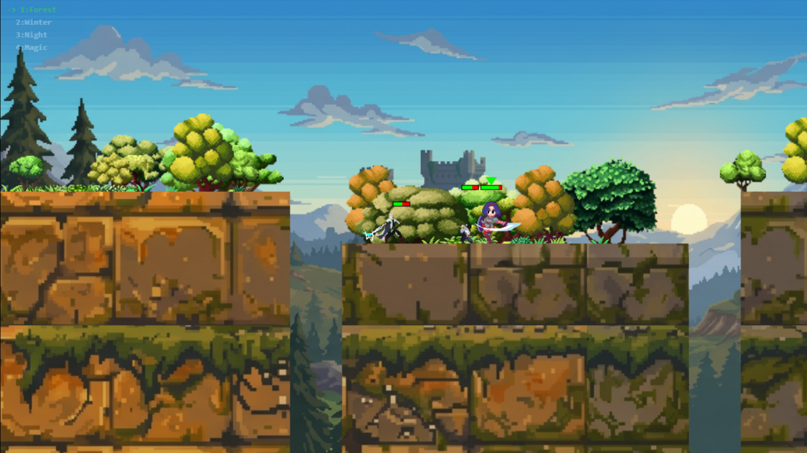
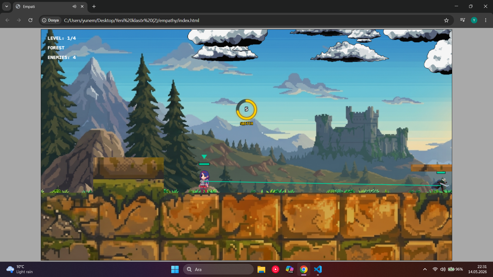
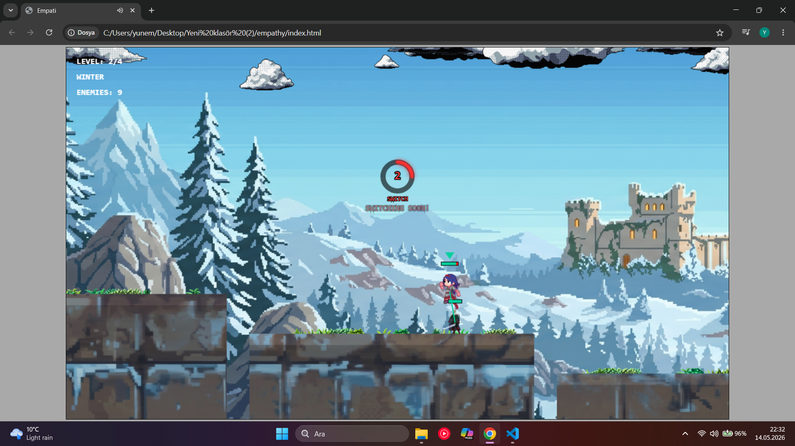

# Empati

  

# Web Tabanlı Programlama 1. Proje Ödevi

## Hazılayanlar

* **24360859081** Yakuphan Salman
* **24360859015** Yunus Emre Aydınlı

## Örnek Oyun
* **Oyun:**[Edna - Out of sight, out of control by kcaze, Varun R.](https://kz.itch.io/edna)
* **Game Jam:**[GMTK Game Jam 2020 - itch.io](https://itch.io/jam/gmtk-2020)
* **Oyun Motoru:** Godot Engine
# Proje

Bu proje, HTML5 Canvas ve saf JavaScript (ES6) kullanılarak sıfırdan geliştirilmiş, performans odaklı ve özellik bakımından zengin bir 2D aksiyon-platform oyun motorudur. İçerisinde gelişmiş yapay zeka, fizik, animasyon ve çevre sistemleri barındırır.

  

## 📸 Ekran Görüntüleri

  

*Özelleştirilmiş hitbox'lar, can barları ve dinamik savaş sistemi.*

  

*Çok katmanlı parallax arka plan, dinamik bitki örtüsü (ağaçlar, çalılar) ve atmosferik hava durumu.*

  

## 🌟 Temel Özellikler

  

### ⚙️ Mekanikler

*  **Geri Sarma:** Tüm karakterlerin belirli durumlarını yığında saklayarak, her kare için geri çağırabilir.

*  **Karakter Değiştirme:** Oyuncu sahnede istediği karaktere belirli bir menzildeyse geçiş yapabilir. Eğer 15 saniye sonunda geçiş yapmazsa zorunlu olarak geçer.

*  **Ana Oyuna Bağlılık:** Bu iki mekanikte seçtiğimiz oyunda bulunuyor.

  

### 🧠 Yapay Zeka (AI)

*  **Durum Makinesi:** Düşmanlar `PATROL`, `CHASE`, `ATTACK` ve `RETURN` durumları arasında dinamik olarak geçiş yapar.

*  **Görüş ve Hafıza:** Yapay zeka, engellerin arkasını göremez. Hedef görüşten çıktığında son bilinen konuma giderek araştırma yapar.

*  **Platform Zekası:** Düşmanlar platformlardan atlayabilir, engellerin etrafından veya üstünden dolaşabilir ve sıkıştıklarında yeni devriye noktaları oluşturabilir. Herhangi bir yol bulma algoritması içermez, sadece devriye noktalarına bağlıdır.

  

### ⚔️ Savaş ve Fizik Sistemi

*  **AABB Çarpışma Tespiti:** Y ve X ekseninde boyuta duyarlı, hassas hitbox hesaplamaları.

*  **Kuvvet ve İvme:** Sürtünme, yerçekimi, geri tepme ve hasar anında sersemletme mekanikleri.

  

### 🌲 Dinamik Çevre ve Kamera

*  **Sinematik Kamera:** Karakteri yumuşak bir şekilde (Lerp) takip eden, yönüne göre ileriye bakan ve dinamik zoom destekleyen kamera sistemi.

*  **Parallax Arka Plan:** Derinlik algısı yaratan, farklı hızlarda kayan bulutlar, ağaçlar ve çalılar. Çan eğrisi dağılım algoritmaları ile doğada organik obje dizilimi.

*  **Tema Yönetimi:** Oyun anında Orman, Kış, Gece ve Büyü temaları arasında geçiş yapabilme (`LevelManager`).

  

### 🎨 Animasyon ve Ses Sistemi

*  **Esnek Sprite Yöneticisi:**  `Idle`, `Run`, `Jump`, `Attack`, `Hurt`, `Death` durumlarına göre bağımsız kare hızlarında çalışan frame tabanlı animasyonlar.

*  **Ses Uzamsallığı:** Aksiyona ve hasara duyarlı, gecikmesiz, konuma bağlı SFX ve BGM yönetimi (`SoundManager`).

  
  

## 🎮 Kontroller

*  **Yön Tuşları / A-D:** Hareket Etme

*  **Boşluk (Space):** Zıplama

*  **E:** Saldırı

*  **Z:** Karakter Değişimi

*  **R:** Geri Sarma

*  **1-2-3-4:** Çevre Temasını Değiştirme

*  **H:** Debug Modu

## Kaynaklar
Oyunda kullanılan kaynaklar [Top game assets - itch.io](https://itch.io/game-assets) sitesinden alınmıştır.
Ayrıca müzik, ses, arka plan görüntüsü yapay zeka ile oluşturulmuştur.